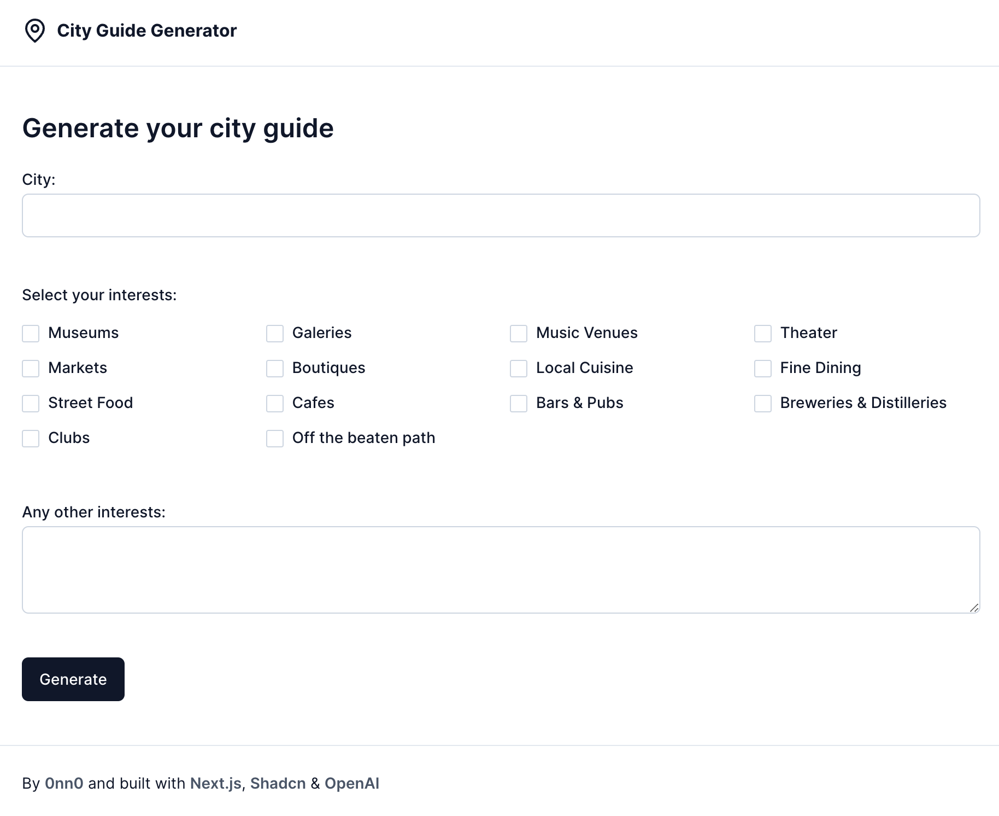

<h2 align="center">City Guide Generator</h2>

    Generate a city guide based on your interests 
    <a href="https://cityguide-generator.vercel.app/">View app</a>

## About this project

Small experiment with the OpenAI API.

### Tech stack

- [ReactJS](https://react.dev/)
- [NextJS](https://nextjs.org/)
- [shadcn/ui](https://ui.shadcn.com/)
- [OpenAI](https://openai.com/)

## Getting Started

### Requirements

- Node.js (version 18.2.0)
- npm

### Setup

- Run `npm i` to install depencies
- Copy `.example.env` and rename it to `.env`
- Add the OpenAI API key to the `.env` file

### Development

- Run `npm run dev` to start the development server, and open [http://localhost:3000](http://localhost:3000) with your browser

### Deployment

The app is hosted on [Vercel](https://vercel.com/). Every commit pushed to the `main` branch will trigger a Production Deployment.
